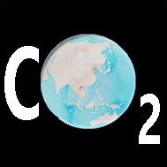
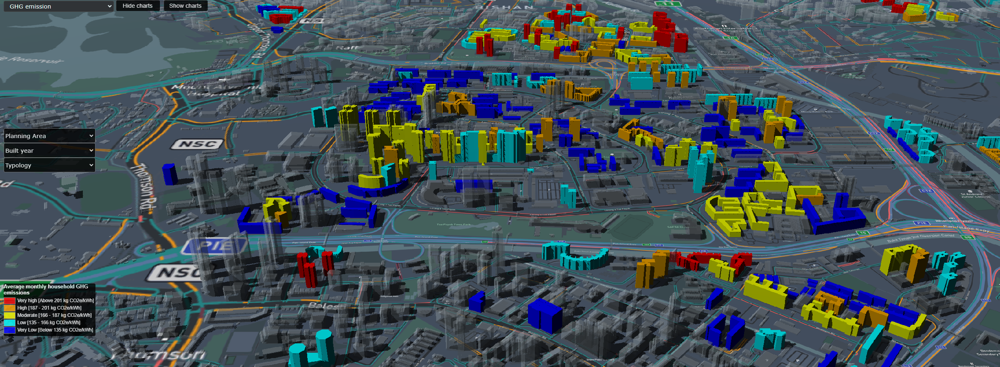

# Project webpage

*This is a project webpage for (UDT-GHG) Urban Digtial Twin for Greenhouse gas emissions. The webpage provides you more information about the project, developer, publications and the 3D web application currently developed. You can [visit the webpage here](https://udtghg.github.io/)*

For more information on the application, contact developer: [Linkedin](https://www.linkedin.com/in/pradeep-attavar-alva-77095012b/)
